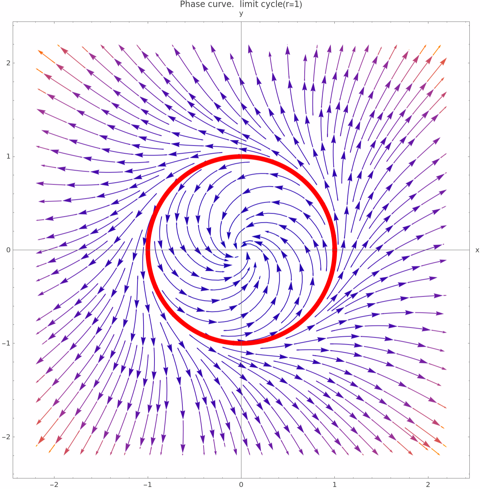

# $\color{red}{\text{第一次project记录}}$  
## $\color{purple}{\text{Part }\mathrm{I.}\text{ Some definitions}}$  
>$\text{Definition 1 }(solution):$  
>$\text{Given a two dimensional autonomous system :}$  
>$$
>\begin{cases}
    \dot{x}=P(x,y) \\
    \dot{y}=Q(x,y)
\end{cases}
>$$  
>$\text{where}$  
>$$
\begin{cases}
    \dot{x} \coloneqq \frac{dx}{dt} \\
    \dot{y} \coloneqq \frac{dy}{dt}
\end{cases}
>$$  
>$\text{We define :}$  
>$$
\begin{cases}
    \dot{x}= \phi(t) \\
    \dot{y}= \psi(t)
\end{cases}
\text{ is a solution} \iff
\begin{cases}
    \phi '(t) = P(\phi(t),\psi(t)) \\
    \psi '(t) = Q(\phi(t),\psi(t))
\end{cases}
>$$  

>$\text{Definition 2 }(Singular \; point):$  
>$\text{Given a vector field }v(x)\coloneqq (P(x),Q(x))$  
>$\text{We say that }x_* \text{ is a }singular \; point \text{ of }v \text{ if }v(x_*)=0$  
>$\color{green}{\text{Remark :}}$  
>$\color{green}{\text{If }x_* \text{ is a }Singular \; point \text{ , then }X=x_* \text{ is a constant solution of the system.}}$  

>$\text{Definition 3 }(Phase \; curve):$  
>$Phase \; curve \coloneqq \{X : \exists t \text{ s.t }X=(\phi(t),\psi(t)) \}$  
>$\color{green}{\text{Remark :}}$  
>$\color{green}{\text{1.The image of a solution is a phase curve.}}$  
>$\color{green}{\text{2.The phase curve is a closed curve}\iff \phi ,\psi \text{ are periodic}}$  

>$\text{Definition 4 }(Limit \; cycles):$  
>$\text{A }limit \; cycle \text{ is an isolated closed curve in the phase plane of a two dimension autonomous system.}$  
>$\text{Isolated means that neighboring curve are not closed,they spiral either toward or away from the closed curve}$  
>$\text{Example :}$  
>$\text{Consider the following system :}$  
>$$
    \begin{cases}
        \dot{x}=-y+x(x^2+y^2-1) \\
        \dot{y}= x+y(x^2+y^2-1)
    \end{cases}
>$$  
>$\text{The system can be written as : }$  
>$$
\begin{cases}
    \dot{r}=r(r^2-1) \\
    \dot{\theta}=1
\end{cases}
>$$  
>$\text{The phase curve is :}$  
>
>$\color{red}{\text{Famous problem }: }$  
>$\text{Given :}$  
>$$
\begin{cases}
    \dot{x}=P(x,y)  \\
    \dot{y}=Q(x,y)
\end{cases}
>$$  
>$\text{1.(16th Hilbert problem) is \#(limit cycle) }< \infin ?$  
>$\text{2. for }deg(P),deg(Q)=2.\text{What is the max \# ?}$  

>$\text{Definition 5 }(First \; integral):$  
>$I(x,y)\text{ is a }first \; integral \text{ of the system if :}$  
>$$
    I(\phi(t),\psi(t))=constant \text{ for all solutions}
>$$  
>$\text{Remark :}$  
>$I:\mathbb{R}^2 \rightarrow \mathbb{R} , I \in C^1(\mathbb{R}^2)$  
>$I \text{ is a First Integral} \iff \frac{\partial I}{\partial x}P+\frac{\partial I}{\partial y}Q \equiv 0$  

>$\text{Definition 6 }(Complex \; form \; of \; system):$  
>$$
\dot{z}=iz+Az^2+B\bar{z}^2+Cz\bar{z}
>$$  
>$\text{where}$  
>$$
    A,B,C \in \mathbb{C}
>$$  
>$\text{is the complex form of two dimesional autonomous system.}$  

>$\text{Definition 7 }(Hamiltonian \; system):$  
>$\text{We say system :}$  
>$$
\begin{cases}
    \dot{x}=P(x,y)  \\
    \dot{y}=Q(x,y)
\end{cases}
>$$  
>$\text{is a }Hamiltonian \; system \text{ if :}$  
>$$
    \exists H:\mathbb{R}^2 \rightarrow \mathbb{R} \text{ s.t } \begin{cases}
        \dot{x}=-H_y \\
        \dot{y}=H_x
    \end{cases}
>$$  
>$\text{Remark :}$  
>$H \text{ is a first integral.}$  

>$\text{Definition 8 }(Symmetic \; system):$  
>$\text{We say system :}$  
>$$
\begin{cases}
    \dot{x}=P(x,y)  \\
    \dot{y}=Q(x,y)
\end{cases}
>$$  
>$\text{is } Symmetic \text{ if :}$  
>$$
\begin{cases}
    \text{(P is even):}P(-x,y)=P(x,y) \\
    \text{(Q is odd):}Q(-x,y)=-Q(x,y)
\end{cases}
>$$ 

## $\color{purple}{\text{Part }\mathrm{II.}\text{ The problems}}$  

- ### Question 1
    >Consider the two dimensional autonomous system :
    >$$
    >A:\begin{cases}
    >\dot{x} = P(x,y)\\
    >\dot{y} = Q(x,y)
    >\end{cases}
    >$$
    >Suppose our domain is simply connected , Is the following statment correct?
    >$$
    div V = 0 \iff A\text{ is a }Hamiltonian \;system
    >$$

- ### Question 2
    >Suppose we have the two dimensional autonomous system :
    >$$
    >A:\begin{cases}
    >\dot{x} = P(x,y)\\
    >\dot{y} = Q(x,y)
    >\end{cases}
    >$$
    >And the complex form of A is given by:
    >$$
    >\tilde{A} : \; \dot{z} = iz + Az^2 + B\bar{z}^2 + Cz\bar{z}
    >$$
    >Supoose :
    >$$
    >A \coloneqq A_1 + iA_2\\
    >B \coloneqq B_1 + iB_2\\
    >C \coloneqq C_1 + iC_2\\
    >\mu \coloneqq (A_1,A_2,B_1,B_2,C_1,C_2)
    >$$
    >Find the condition of $\mu$ such that $\tilde{A}$ is a $Hamiltonian \; system.$

