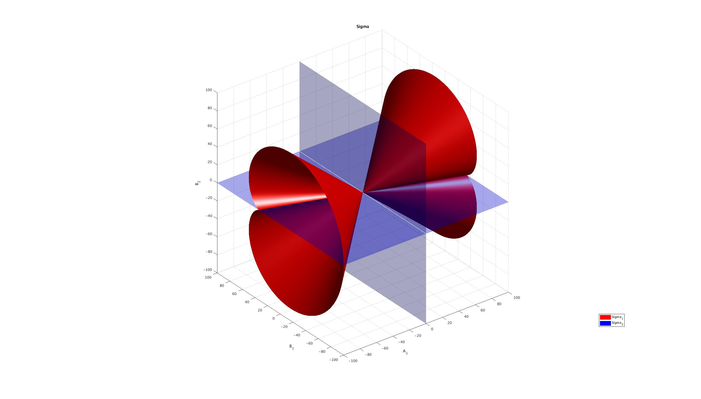

# $\color{red}{\text{MISSION 2}}$  

## $\color{purple}{\text{Part }\mathrm{I.}\text{ Problem}}$  
>$\text{Given an Hamiltonian system(in complex form) :}$  
>$$
A:\dot{z}=iz+Az^2+B\bar{z}^2+Cz\bar{z}
>$$  
>$\text{where}$  
>$$
A \coloneqq A_1+iA_2 \\ B \coloneqq B_1+iB_2 \\ C \coloneqq C_1+iC_2
>$$
>$\text{Now , find and draw the bifurcation diagram }\Sigma \coloneqq \Sigma_1 \cup \Sigma_2$  

## $\color{purple}{\text{Part }\mathrm{II.}\text{ Solving}}$  
### $\color{red}{\text{Step 1 : to find }H}$
$\text{We know that : Without losing generality , We can assume that :}$  
$$
Im(C)=0
$$  
$\text{That is :}$  
$$
C_2=0
$$  
$\text{Since }A\text{ is Hamiltonian system , so we have :}$  
$$
2A=-\bar{C}
$$  
$\Rightarrow$  
$$
\begin{cases} C_2=0 \\ A_2=0  \\ 2A_1= -C_1 \end{cases}
$$  
$\text{Therefore , system }A\text{ is :}$  
$$
A:\dot{z}=iz+A_1z^2+(B_1+iB_2)\bar{z}^2-2A_1z\bar{z}
$$  
$\iff$  
$$
\dot{x}+i\dot{y}= (-y+A_1x^2-A_1y^2+B_1x^2-B_1y^2+2B_2xy-2A_1(x^2+y^2)) \\ + i(x+2xyA_1-2xyB_1+B_2x^2-B_2y^2)
$$  
$\text{Therefore , we get the original form of }A :$  
$$
A:\begin{cases} \dot{x}= -y+(B_1-A_1)x^2+(-B_1-3A_1)y^2+2B_2xy \\ \dot{y}= x+B_2x^2-B_2y^2+2(A_1-B_1)xy \end{cases}
$$  
$\text{Again , since }A\text{ is Hamiltonian , then :}$  
$$
\exists H \text{ s.t} \begin{cases} \mathrm{I.}\text{ }\dot{x}=H_y  \\ \mathrm{II.}\text{ }\dot{y}=-H_x \end{cases}
$$  
$\text{Now , we try to solve the }H\text{ out :}$  
$\overset{\text{by }\mathrm{I}}{\Rightarrow}$  
$$
H=\int \dot{x} dy
$$  
$\iff$  
$$
H=\int (-y+(B_1-A_1)x^2+(-B_1-3A_1)y^2+2B_2xy) dy 
$$  
$\iff$  
$$
H=-\frac{1}{2}y^2+(B_1-A_1)x^2y-(\frac{B_1}{3}+A_1)y^3+B_2xy^2 + constant_1+f(x)
$$  
$\text{Then , by }\mathrm{II}:$  
$\overset{by \text{ }\mathrm{II}}{\Rightarrow}$  
$$
-\dot{y}=H_x=(B_1-A_1)2xy+B_2y^2+f'(x)
$$  
$\text{That is :}$  
$$
(B_1-A_1)2xy+B_2y^2+f'(x) = -x-B_2x^2+B_2y^2-2(A_1-B_1)xy
$$  
$\iff$  
$$
f'(x)=-x-B_2x^2
$$  
$\Rightarrow$  
$$
f(x)=-\frac{x^2}{2}-\frac{B_2}{3}x^3 + constant_2
$$  
$\text{Therefore :}$  
$$
H=-\frac{1}{2}y^2+(B_1-A_1)x^2y-(\frac{B_1}{3}+A_1)y^3+B_2xy^2 -\frac{x^2}{2}-\frac{B_2}{3}x^3+constant_1+constant_2 \\ = -\frac{1}{2}(x^2+y^2)+(B_1-A_1)x^2y-(\frac{B_1}{3}+A_1)y^3+B_2xy^2 -\frac{B_2}{3}x^3+constant_3
$$  
$\text{Where }constant_3\coloneqq constant_1+constant_2$  
### $\color{red}{\text{Step 2 : draw the graph of }\Sigma_1}$  
$\text{By the definition of }\Sigma_1 :$  
$$
\exists(x_0,y_0)\text{s.t}\begin{cases} H_x(x_0,y_0,\lambda)=0 \\ H_y(x_0,y_0,\lambda)=0 \\ det(HessH(x_0,y_0,\lambda)) =0 \end{cases}
$$  
$\text{After computing }H_x,H_y,det(HessH)\text{ , we get :}$  
$$
\begin{cases} (H_x):0=-x_0-B_2x_0^2+B_2y_0^2-2(A_1-B_1)x_0y_0 \\ (H_y):0=-y_0+(B_1-A_1)x_0^2+(-B_1-3A_1)y_0^2+2B_2x_0y_0 \\ (detHess):0=1+8A_1y_0-(4B_2^2+4(A_1-B_1)^2)x_0^2+(12A_1^2-4B_1^2-4B_2^2-8A_1B_1)y_0^2+16A_1B_2x_0y_0\end{cases}
$$  
$\overset{\text{Cancel out the }x_0,y_0 }{\Rightarrow}$  
$$
\color{red}{A_1^4 + 8 A_1^3 B_1 + 18 A_1^2 B_1^2 - 27 B_1^4 + 18 A_1^2 B_2^2 - 54 B_1^2 B_2^2 - 27 B_2^4=0} \tag{*}
$$  
$\text{We draw the graph of (*) and get the graph of }\Sigma_1 :$  

### $\color{red}{\text{Step 3 : draw the graph of }\Sigma_2}$  
$\text{By the definiton of }\Sigma_2:$  
$$
H(x,y,\lambda)\text{ has two diffenent critical points }(x_1,y_1),(x_2,y_2)\text{s.t }H(x_1,y_1,\lambda)=H(x_2,y_2,\lambda)
$$  
$\text{That is :}$  
$$
\begin{cases}
    H_x(x_1,y_1,\lambda)=0 \\
    H_x(x_2,y_2,\lambda)=0 \\
    H_y(x_1,y_2,\lambda)=0 \\
    H_y(x_2,y_2,\lambda)=0 \\
    H(x_1,y_1,\lambda)=H(x_2,y_2,\lambda)
\end{cases}
$$  
$\text{Since we have compute }H_x , H_y\text{ before , So that is :}$  
$$
\begin{cases}
    (H_x):0=-x_1-B_2x_1^2+B_2y_1^2-2(A_1-B_1)x_1y_1 \\
    (H_x):0=-x_2-B_2x_2^2+B_2y_2^2-2(A_1-B_1)x_2y_2 \\
    (H_y):0=-y_1+(B_1-A_1)x_1^2+(-B_1-3A_1)y_1^2+2B_2x_1y_1 \\
    (H_y):0=-y_2+(B_1-A_1)x_2^2+(-B_1-3A_1)y_2^2+2B_2x_2y_2 \\
    (H):-\frac{1}{2}(x_1^2+y_1^2)+(B_1-A_1)x_1^2y_1-(\frac{B_1}{3}+A_1)y_1^3+B_2x_1y_1^2 -\frac{B_2}{3}x_1^3 \\
    \qquad =-\frac{1}{2}(x_2^2+y_2^2)+(B_1-A_1)x_2^2y_2-(\frac{B_1}{3}+A_1)y_2^3+B_2x_2y_2^2 -\frac{B_2}{3}x_2^3
\end{cases}
$$  
$\overset{\text{Cancel out the }x_1,y_1,x_2,y_2}{\Rightarrow}$  
$$
\color{red}{A_1B_2=0} \tag{**}
$$  
$\text{We draw the graph of (**) and get the graph of }\Sigma_2: $  

### $\color{red}{\text{Step 3 : draw the graph of }\Sigma}$  
$\text{By the definition of }\Sigma:$  
$$
\Sigma \coloneqq \Sigma_1 \cup \Sigma_2
$$  
$\text{Therefore , the graph of }\Sigma \text{ is the union of }\Sigma_1\text{(red) and } \Sigma_2 \text{(blue) , that is :}$  

## $\color{purple}{\text{Part }\mathrm{III.}\text{ Remarks}}$  
$\text{Actually , it is difficult to get the result of (*) and (**)}$  
$\text{So , I use the }Mathematica\text{ to solve it and get the result of (*) and (**)}$  
$\text{The following are the code of getting (*) and (**) :}$  
### $\color{red}{\text{The code of get (*) :}}$  
```wl
INPUT :
    
    ClearAll["Global`*"]

    H[x_, y_, A1_, B1_, B2_] := -1/2 (x^2 + y^2) - 1/3 B2 x^3 + B2 x y^2 + (B1 - A1) x^2 y - (B1 + 3 A1)/3 y^3;

    eqs = {
    D[H[x, y, A1, B1, B2], x] == 0,
    D[H[x, y, A1, B1, B2], y] == 0,
    Det[D[H[x, y, A1, B1, B2], {{x, y}, 2}]] == 0
    };

    GroebnerBasis[eqs, {A1, B1, B2}, {x, y}]

OUTPUT :

    {A1^4 + 8 A1^3 B1 + 18 A1^2 B1^2 - 27 B1^4 + 18 A1^2 B2^2 - 54 B1^2 B2^2 - 27 B2^4}
```
### $\color{red}{\text{The code of get (**) :}}$  
```wl
INPUT :

    ClearAll["Global`*"]

    H[x_, y_, A1_, B1_, B2_] := -1/2 (x^2 + y^2) - 1/3 B2 x^3 + B2 x y^2 + (B1 - A1) x^2 y - (B1 + 3 A1)/3 y^3;

    grad[x_, y_, A1_, B1_, B2_] := {D[H[x, y, A1, B1, B2 ], x], D[H[x, y, A1, B1, B2 ], y]};

    eqsSigma2 = {grad[x1, y1, A1, B1, B2][[1]] == 0, 
    grad[x1, y1, A1, B1, B2][[2]] == 0, 
    grad[x2, y2, A1, B1, B2][[1]] == 0, 
    grad[x2, y2, A1, B1, B2][[2]] == 0, 
    H[x1, y1, A1, B1, B2] - H[x2, y2, A1, B1, B2] == 0, 
    t ((x1 - x2)^2 + (y1 - y2)^2) - 1 == 0};

    GroebnerBasis[eqsSigma2, {A1, B1, B2}, {x1, y1, x2, y2, t}]

OUTPUT :

    {A1 B2}
```


